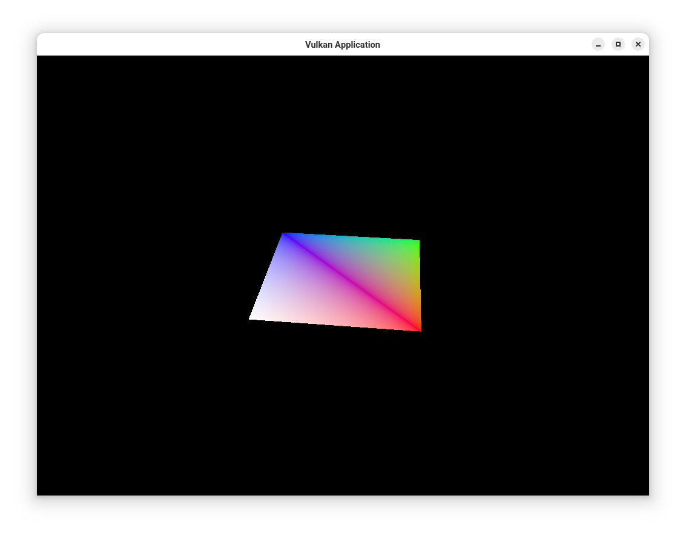

EADME.rst

Vulkan Application
******************
This application implements an object oriented approach to the 
`Vulkan Tutorial <https://vulkan-tutorial.com/>`_ up to
Uniform Buffer Objects.  This application produces a spinning
square at an angle, and allows the user to resize the window
and zoom into and out of the screen.

This repository is intended to be a starting point for development of 
applications that do not need to implement further Vulkan Attributes and 
is still in development.  Future users of this repository are encouraged 
to add unit testing and mutex's for thread safety.

Contributing
############
This package is archived for my internal purposes.  However, if you wish to 
contribute, please contact the author to authorize a pull request

License
#######
This software is developed under a simple MIT license.

Requirements
############
This library is developed and tested on Macintosh and Arch Linux Operating
Systems.  It is developed with ``g++ 14.1.1`` and ``clang 16.0.6`` compilers. In
addition, this code base requires the use of ``CMake 3.29.6``, and 
``valgrind``.

Installation
############
This project is covered under a basic MIT license which allows anyone to use 
this code base or to contribute to it with the express permsission of the 
git project owner.

Use Code Base 
-------------
In order to download this repository from github, follow these instructions

#. Ensure you have ``.git`` installed on your computer

#. Ensure you have ``cmake`` installed on your computer.  This code-base requires 
   cmake version 3.27.7 or later versions.

#. Download this repository to your preferred directory with the following command;

   .. code-block:: bash 

      git clone https://github.com/Jon-Webb-79/VulkanApplication.git VulkanApplication 

#. Navigate to either the bash or zshell scripts directory depending on your 
   environment with one of the following commands.

   .. code-block:: bash 

      cd csalt/scripts/bash 
      cd csalt/scripts/zsh 

#. Build the code base with the following command.

   .. code-block:: bash 

      # If using bash
      bash debug.sh  
      # If using zsh 
      zsh debug.zsh

#. Navigate to ``csalt/csalt/build/debug`` to run the debug version 

   .. code-block:: bash 

      ./VulkanApplication
      
#. If all unit tests do not pass with no memory leaks, you may need to contact 
   the administrator of this git repository.  If they do pass, then you are set 
   to transform this code-base into a static or dynamic library, or just 
   copy the ``.c`` and ``.h`` files to your project.

#. If the debug build works correctly, then the user is encoruaged to create 
   a release version by the following command within the scripts directory.

   .. code-block:: bash 

      zsh release.zsh
      ./VulkanApplication

